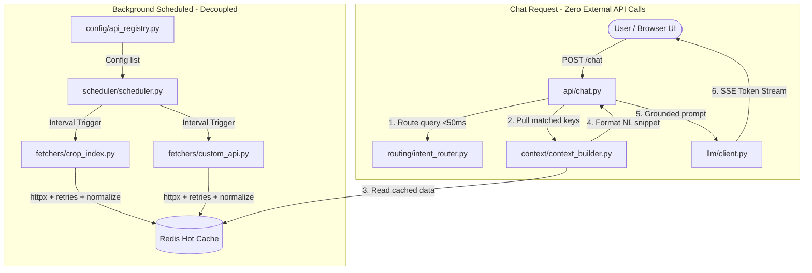

# CropO Chatbot Backend

> **FastAPI Chatbot with Decoupled Offline Pre-fetching & Redis Hot Cache**

A high-performance chatbot backend built with **FastAPI**, **APScheduler**, and **Redis** designed to eliminate external API latency and rate-limit bottlenecks by completely separating the offline background data fetch pipeline from the online user query pipeline.

---

## 🏛️ Core Architecture Principle

The system enforces **two strictly decoupled pipelines**:



1. **OFFLINE Pipeline**:
   - Background `APScheduler` triggers independent API fetcher functions according to configured intervals.
   - Each fetcher calls its target API with retry/backoff, normalizes the response into a structured schema, and writes it to Redis with a TTL.
   - **Stale-on-failure guarantee**: If an external API fails or errors, existing cached data in Redis is preserved (never wiped).

2. **ONLINE Pipeline**:
   - `POST /chat` receives user queries.
   - Routes the query to relevant domain(s) in **< 50ms** with zero network calls.
   - Retrieves the cached domain state from Redis and converts it into a concise **natural-language snippet** (never raw JSON dumps).
   - Injects the snippet into the LLM prompt with a strict **grounding rule** ("answer only using provided context").
   - Streams tokens back to the client using **Server-Sent Events (SSE)**.
   - **GUARANTEE**: The `/chat` endpoint **NEVER** makes external HTTP requests.

---

## 📁 Directory Structure

```text
cropO-chatbot/
├── app/
│   ├── main.py                  # FastAPI app lifespan (warm-up + scheduler + static files)
│   ├── config/
│   │   ├── settings.py          # Pydantic BaseSettings (env vars, Redis, LLM, CropO APIs)
│   │   └── api_registry.py      # Single source of truth: declarative list of all CropO APIs
│   ├── fetchers/
│   │   ├── base.py              # Shared async fetch with retry/backoff & error handling
│   │   ├── plots_info.py        # Fetches /plots and /plots/{name}/info
│   │   ├── cropo_weather.py     # Fetches /current-weather & /current-temperature
│   │   ├── soil_irrigation.py   # Fetches /soil-moisture & irrigation guides
│   │   └── field_score.py       # Fetches /field_score NDVI health ratings
│   ├── cache/
│   │   └── redis_client.py      # Async Redis client with metadata tracking & fallback
│   ├── scheduler/
│   │   └── scheduler.py         # Dynamic APScheduler runner (reads api_registry.py)
│   ├── routing/
│   │   └── intent_router.py     # Sub-millisecond keyword router (<50ms)
│   ├── context/
│   │   └── context_builder.py   # Converts Redis cache into concise natural language snippets
│   ├── llm/
│   │   ├── client.py            # Unified LLM client (Mock, OpenAI, Anthropic, Ollama)
│   │   └── prompts.py           # Grounding system prompt & template
│   ├── api/
│   │   ├── chat.py              # POST /chat endpoint (SSE streaming from Redis cache)
│   │   └── debug.py             # GET /debug/cache diagnostic endpoint
│   └── static/
│       ├── index.html           # Single-page test UI with Cache Status monitor
│       ├── style.css            # Modern responsive styling
│       └── chat.js              # SSE stream consumer & live token renderer
├── .env.example
├── requirements.txt
├── Dockerfile
├── docker-compose.yml
└── README.md
```

---

## 🚀 Quick Start

### Option 1: Run with Docker Compose (Recommended)

1. Clone the repository and navigate to the directory:
   ```bash
   cd cropO-chatbot
   ```

2. Start the FastAPI backend and Redis container:
   ```bash
   docker-compose up --build
   ```

3. Open your browser at:
   **`http://localhost:8000`**

---

### Option 2: Run Locally with Python

1. **Prerequisites**: Python 3.11+ and Redis (optional; built-in in-memory fallback will automatically activate if Redis is offline).

2. **Install dependencies**:
   ```bash
   python -m venv venv
   source venv/bin/activate   # On Windows: venv\Scripts\activate
   pip install -r requirements.txt
   ```

3. **Configure Environment**:
   ```bash
   cp .env.example .env
   ```

4. **Launch the FastAPI Server**:
   ```bash
   uvicorn app.main:app --host 0.0.0.0 --port 8000 --reload
   ```

5. Access the test UI at: **`http://localhost:8000`**

---

## 🛠️ Step-by-Step: How to Add a New API Fetcher

Adding a new API to the offline background pre-fetching pipeline is strictly a **2-step process**. No changes are needed in `scheduler.py`, `chat.py`, or the core loop.

### Step 1: Add a Definition Entry in `app/config/api_registry.py`

Open [app/config/api_registry.py](file:///c:/Users/Akshay.Mahajan/Desktop/Smit/cropO-chatbot/app/config/api_registry.py) and append your API configuration:

```python
API_REGISTRY = [
    # ... existing APIs ...
    {
        "name": "fertilizer_rates",
        "base_url_setting": "FERTILIZER_API_BASE_URL",
        "endpoint": "/api/v1/rates/latest",
        "auth_header": "Authorization",
        "auth_setting": "FERTILIZER_API_KEY",
        "interval_seconds": 1800,  # 30 minutes
        "cache_key": "data:fertilizer_rates:latest",
        "fetcher_module": "app.fetchers.fertilizer_rates",
        "fetcher_function": "fetch_fertilizer_rates",
        "keywords": ["fertilizer", "urea", "potash", "nitrogen", "phosphorus", "npk"],
        "description": "Global and regional fertilizer spot prices and application rates.",
    }
]
```

### Step 2: Create `app/fetchers/<name>.py`

Create `app/fetchers/fertilizer_rates.py` containing **only** this API's HTTP call, normalization, and Redis write logic:

```python
from app.fetchers.base import async_fetch_with_retry
from app.cache.redis_client import redis_client
from app.config.settings import settings
import structlog

logger = structlog.get_logger(__name__)

CACHE_KEY = "data:fertilizer_rates:latest"
TTL_SECONDS = 1800

async def fetch_fertilizer_rates() -> bool:
    url = f"{settings.FERTILIZER_API_BASE_URL.rstrip('/')}/api/v1/rates/latest"
    headers = {"Authorization": f"Bearer {settings.FERTILIZER_API_KEY}"}
    
    # 1. Fetch with automatic retries and 5s timeout
    raw = await async_fetch_with_retry(url=url, headers=headers)
    if raw is None:
        # Stale-on-failure: retain previous cache
        logger.warning("fertilizer_fetch_failed_retaining_cache", key=CACHE_KEY)
        return False

    # 2. Normalize raw payload into clean domain structure
    normalized = {
        "status": "success",
        "rates": raw.get("rates", []),
        "advisory": raw.get("advisory", "Standard application guide")
    }

    # 3. Store normalized payload in Redis with TTL
    await redis_client.set_json(CACHE_KEY, normalized, ttl_seconds=TTL_SECONDS)
    return True
```

*(Optional)* Add a natural-language formatting template in `app/context/context_builder.py` under `DOMAIN_FORMATTERS` for optimal LLM prompt brevity.

---

## ⚙️ Configuration Variables (`.env`)

| Variable | Default | Description |
| :--- | :--- | :--- |
| `APP_HOST` | `0.0.0.0` | Host binding address |
| `APP_PORT` | `8000` | Port binding |
| `LOG_LEVEL` | `INFO` | Logging level (`INFO`, `DEBUG`, `JSON`) |
| `REDIS_URL` | `redis://localhost:6379/0` | Redis hot cache connection URI |
| `LLM_PROVIDER` | `mock` | Backend provider: `mock`, `openai`, `anthropic`, `ollama` |
| `LLM_API_KEY` | `""` | API Key for OpenAI / Anthropic |
| `LLM_MODEL` | `gpt-4o-mini` | LLM model identifier |
| `LLM_BASE_URL` | `http://localhost:11434` | Endpoint for Ollama or custom proxy |
| `CROP_API_BASE_URL` | `http://localhost:8000` | Base URL for custom Crop Index API |
| `CROP_API_KEY` | `sample_crop_secret_key_12345` | Auth key for Crop Index API |
| `ENABLE_EMBEDDING_ROUTING` | `false` | Enable `sentence-transformers` router |

---

## 🔍 Diagnostics & Debug Endpoints

- **`GET /debug/cache`**: Returns live diagnostics on all registered domains, whether they are in cache, last updated timestamps, and TTL countdowns.
- **`POST /debug/refresh/{domain_name}`**: Triggers an on-demand manual refresh of a specific domain's fetcher in the background.
- **`GET /api/v1/crops/index`**: Built-in mock data source for the Crop Index API.
